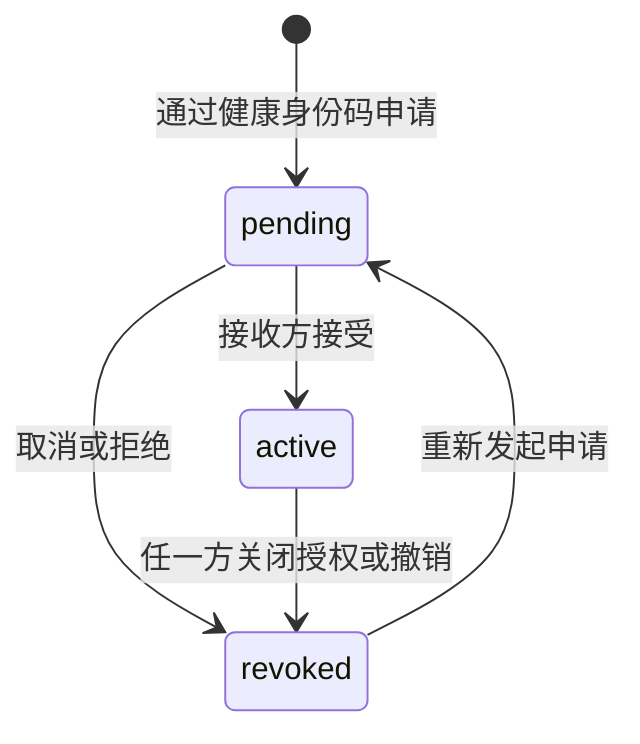
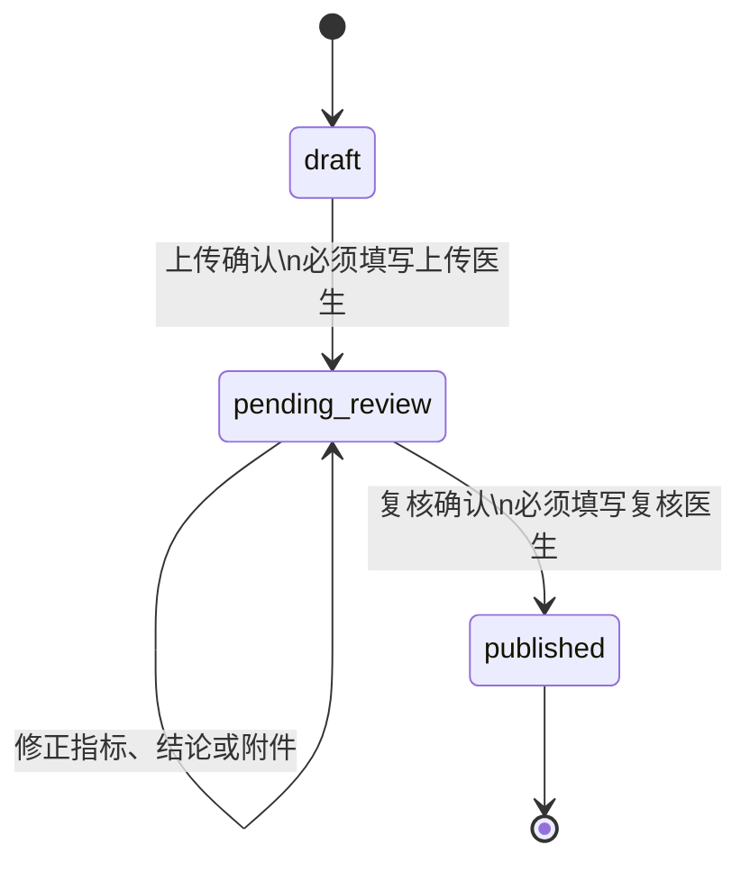
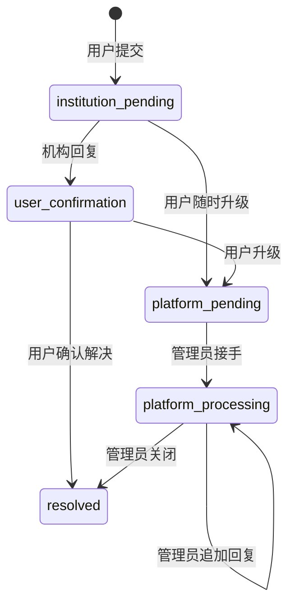

# HealthDoc 业务规则与验收契约（schema v12）

> 文档状态：schema v12 当前业务与验收契约，更新于 2026-08-04。
> 历史说明：schema v10 的有效业务演进已归入《项目需求与技术方案》和数据库主题文档；schema v11 的 Agent/OAuth/MCP 增量已归入《AI 与 OCR 开发说明》和数据库主题文档，不再维护按轮次拆分的重复实施说明。
> 发布记录：最终 Git SHA、服务器 release、备份位置与线上冒烟结果必须在真实发布完成后回填，本文不预先宣称测试或部署成功。

## 1. 当前范围与固定口径

schema v12 在原健康管理、机构履约和 Agent 能力上统一交付：

- 访客可浏览启用的机构、分院、在售套餐和公开评论，但不能预约或执行其他写操作；
- 机构账号不再公开注册，一个分院只有一个有效机构账号，由平台管理员随分院一起创建；
- 普通用户首次确认姓名、性别、出生日期后完成平台内实名认证，之后只能由管理员修正；
- 亲友接受申请后形成双向关联账号，可以直接切换账号；服务端仍区分真实操作者与当前有效账号；
- 多人预约参与人来自本人、关联账号或一次性健康身份码参与人令牌，最多五人；
- 所有预约入口使用上海时区，最早明天、最晚今天后第 30 天；
- 报告使用 `draft → pending_review → published`；
- 投诉、评论处罚/申诉和机构经营画像成为正式业务对象；
- 数据库、演示数据、发布脚本和健康检查统一到 schema v12。

固定隐私边界：

1. 健康身份码是本次代预约凭证，不是登录凭据，也不建立亲友关系。
2. 健康身份码匹配成功后不需要受检者二次确认，但受检者可以关闭后续健康码代预约。
3. 预约人不能填写或修改平台已有的姓名、性别、出生日期。
4. 健康码临时参与人不会获得账号切换或健康数据访问权。
5. 原始健康身份码不进入 URL、浏览器持久缓存、普通日志、Agent 工具日志或模型上下文。

### 1.1 验收追踪索引

| 验收主题 | 当前契约位置 | 最终证据位置 |
|---|---|---|
| 实名认证与全局写守卫 | 第 2、5 节 | 《测试报告》schema v12 门禁 |
| 双向关联账号、actor/subject 与三层链 | 第 6 节 | 关联会话安全与撤销回归 |
| 健康身份码隐私边界与三类参与人 | 第 7 节 | 参与人解析、令牌、预约/候补回归 |
| 报告与投诉状态机 | 第 9、10 节 | 状态冲突、权限、事务回归 |
| 评论处罚、单次申诉与当前有效账号禁言 | 第 11 节 | 评论治理回归 |
| 机构经营画像 | 第 12 节 | 分院/主体范围、匿名聚合回归 |
| schema v12 增量、迁移、验收数据与回滚 | 第 13—15 节 | 迁移/校验器及 openGauss 演练记录 |
| 同一 Git SHA、冷备份和通知 worker 启动门闩 | 第 17 节 | 《服务器部署与同步》最终发布回填 |

## 2. 角色、页面与权限矩阵

| 能力 | 访客 | 普通用户本人 | 切入的关联账号 | 机构账号 | 系统管理员 |
|---|---:|---:|---:|---:|---:|
| 浏览公开机构、分院、套餐、公开评论 | 是 | 是 | 是 | 是 | 是 |
| 普通用户自助注册 | 是 | 不适用 | 不适用 | 否 | 否 |
| 日常测量、预约、评论、投诉 | 否 | 完成身份后 | 以当前有效账号执行 | 否 | 否 |
| 查看当前有效账号健康档案 | 否 | 是 | 是 | 否 | 否 |
| 注销当前普通用户或机构账号 | 否 | 仅账号本人会话 | 否 | 仅本机构原始会话 | 管理员停用/恢复 |
| 修改当前账号密码或邮箱 | 否 | 需现有安全校验 | 仍需被切入账号的安全校验 | 需现有安全校验 | 不代替用户安全校验 |
| 创建分院及机构账号 | 否 | 否 | 否 | 否 | 是 |
| 查看/修正普通用户基本身份 | 否 | 首次填写、不可自改 | 同本人规则 | 否 | 是 |
| 查看普通用户报告正文或自测 | 否 | 本人 | 当前有效账号 | 仅业务允许的已发布报告 | 否 |
| 处理机构投诉 | 否 | 投诉/确认/升级 | 以当前有效账号执行 | 本分院 | 平台升级后接管 |
| 评论处罚与申诉处理 | 否 | 可申诉 | 禁言只检查当前有效账号 | 否 | 是 |
| 机构经营画像 | 否 | 否 | 否 | 本分院/所属主体匿名聚合 | 否 |

未实名认证的普通用户只允许公开/个人只读访问、完成实名认证、修改密码或邮箱和退出登录。其他业务写操作统一由应用边界返回：

```json
{
  "code": "IDENTITY_REQUIRED",
  "message": "请先完成实名认证后再使用该功能"
}
```

## 3. 访客目录与平台联系方式

公开接口位于 `/api/public`：

| 接口 | 返回范围 |
|---|---|
| `GET /api/public/contact` | 平台地址、电话、邮箱 |
| `GET /api/public/organizations` | 启用机构主体及启用分院的公开投影 |
| `GET /api/public/institutions/{id}` | 单个启用分院的公开详情 |
| `GET /api/public/institutions/{id}/packages` | 已启用、当前可售套餐 |
| `GET /api/public/institutions/{id}/comments` | 已公开评论 |

公开 DTO 不返回登录邮箱、机构账号、内部容量、审核状态、受检者或健康数据。访客点击预约时，前端跳转登录页并保留合法的机构、套餐和日期参数；登录后返回预约流程，最终写入仍由后端鉴权和日期规则校验。

统一平台联系方式由 `backend/app/services/platform_contact.py` 提供：

- 地址：上海市宝山区上大路99号
- 电话：021-114514
- 邮箱：shucs666@shu.edu.cn

## 4. 机构单账号、凭据投递与注销

### 4.1 创建和凭据投递

`POST /api/auth/register` 只创建 `user`。携带历史 `invite_code` 会返回 `INSTITUTION_SELF_REGISTRATION_DISABLED`，管理员邀请接口仅保留兼容提示，不再创建新机构账号。

管理员创建分院时必须同时提供：

- 全局唯一 `username`；
- 8—128 位初始 `password`；
- 有效机构 `email`；
- 分院业务资料。

分院、机构账号和 `notification_outbox` 在一个事务中写入。用户表只保存密码哈希；发件箱中的临时账号凭据使用 `ACCOUNT_CREDENTIAL_ENCRYPTION_KEY` 进行 AES-GCM 加密。邮件发送成功后，worker 清除 `encrypted_credentials` 并写入 `sensitive_payload_cleared_at`。邮件失败不回滚已创建账号，管理员可以查看投递状态和重试；凭据已清除后必须先重置新密码再重新发送。

生产 `ACCOUNT_CREDENTIAL_ENCRYPTION_KEY` 必须是至少 32 字符的独立高熵随机值，不与 Agent、JWT 或 SMTP 密钥复用，也不提交仓库。数据库与 root-only 环境文件组成同一冷备份/恢复点；若丢失或提前轮换该密钥，尚未投递的机构凭据将无法解密。

相关接口：

| 接口 | 说明 |
|---|---|
| `POST /api/admin/organizations/{id}/branches` | 在同一事务创建分院、账号和待发邮件 |
| `GET /api/admin/institutions/{id}/account` | 查看账号与最新投递状态 |
| `POST /api/admin/institutions/{id}/account-notification/retry` | 重试仍持有加密凭据的失败邮件 |
| `POST /api/admin/institutions/{id}/account/reset` | 设置新初始密码和邮箱并重新投递 |

数据库对 `users.managed_institution_id` 建立唯一约束。v11→v12 迁移按同一分院用户 ID 最小者保留有效绑定，其余重复机构账号停用、解除分院绑定并递增 `token_version`。

### 4.2 自助注销与恢复

机构注销是分院和机构账号的软停用。注销前预检必须同时为零：

- `future_effective_appointments`：今天及以后仍未履约的有效预约；
- `arrived_unfinished_reports`：已到检但报告未完成；
- `draft_or_pending_reports`：草稿或待复核报告；
- `unresolved_complaints`：未解决投诉；
- `other_upload_tasks`：缺报告的到检任务或过期未核销任务。

候补不是注销阻塞项；注销成功时活动候补统一转为无效，并向订阅用户发送站内/邮件通知。账号 `token_version` 递增，分院和套餐退出公开目录，历史预约、报告、投诉保留。管理员恢复分院时重新启用账号并再次递增令牌版本。

## 5. 实名认证

平台内实名认证字段为：

- `real_name`：姓名；
- `gender`：性别；
- `birth_date`：出生日期；
- `identity_completed_at`：首次确认完成时间。

新用户登录后由前端显示一次性完善弹窗，可以暂时关闭；`POST /api/profile/me/complete` 首次成功后，普通用户不能再修改以上三项。`PUT /api/profile/me` 只处理仍允许用户维护的资料和隐私设置。

管理员使用 `PUT /api/admin/users/{id}/basic-profile` 查看并修正基本身份；管理员接口不得返回报告、自测、过敏史或既往史。修正后写入通知邮件任务，邮件失败按 outbox 重试。已经创建的预约继续使用当时的身份资料副本，不被之后的身份修正回写。

多人预约的每个目标必须是启用、已完成身份的普通用户；否则不允许成为参与人。

## 6. 双向关联账号安全模型

### 6.1 关系生命周期

亲友通过健康身份码发起申请，接收方确认后形成双向关联关系。双方分别保存自己的备注。关系状态为：



`active` 同时代表双方可以直接切换账号和为对方预约；旧的健康查看开关、代预约开关只作为兼容入口映射到同一关系生命周期。任一方撤销即整条关系失效，再次关联必须重新申请并接受。

### 6.2 受控切换会话

切换账号不共享密码。服务端签发受控关联会话：

- `actor_user_id`：最初真实登录用户；
- `subject_user_id`：当前有效账号；
- `chain_user_ids`：完整用户链；
- `relation_chain`：每一跳的关系 ID 和授权版本；
- `token_version_snapshot`：链上账号安全版本快照；
- `depth`：切换层数，范围 1—3。

连续向新的关联账号切换最多三层；链内账号不能重复，因此不能形成环。已在当前链路中的账号仍会显示在可切换列表中，用户可以通过同一个“切换账号”动作回到任一祖先账号，再继续切换到其他关联账号，不需要“返回上一级”按钮。入口固定在个人工作台侧栏左下角，与“退出登录”并列；顶栏不再重复显示专用切换按钮。每次请求重新校验：

1. 关联会话仍为 active 且未过期；
2. 链路、父会话和 JWT 声明一致；
3. 链上账号均启用且 `token_version` 未变化；
4. 每一跳关系仍为 active，授权版本未变化。

关系撤销、账号停用、密码安全版本变化或链路中任一授权失效，都会使后续请求失败。退出登录结束原操作者的全部关联会话并返回普通登录页，不回退到上一级账号。

前端始终展示当前有效账号。健康敏感读取和全部写操作写入 `delegated_action_audits`，记录真实操作者、有效账号、链路、请求动作和结果。关联会话禁止注销账号；修改密码或邮箱仍必须通过当前有效账号既有的密码/邮箱验证码校验。

评论禁言只检查 `subject_user_id`。真实操作者切换到未禁言的关联账号后可用该账号评论，但审计仍保留真实操作者。

## 7. 多来源参与人和健康身份码代预约

### 7.1 三种参与人

| `participant_type` | 来源 | 权限依据 |
|---|---|---|
| `self` | 当前有效账号本人 | 当前会话 |
| `linked_account` | active 双向关联账号 | 关系 ID 与授权版本 |
| `health_code_token` | 输入目标健康身份码后签发的一次性令牌 | 令牌哈希、预约人、目标用户、授权版本和过期时间 |

同一个人不论通过哪种来源，在一个预约组中只能出现一次；整组最多五人。

### 7.2 健康身份码解析

`POST /api/booking-participants/resolve` 接收完整健康身份码。目标必须同时满足：

- 普通用户；
- 账号启用；
- 已完成实名认证；
- `allow_health_id_proxy_booking=true`。

不存在、停用、未认证或关闭开关统一返回 `HEALTH_ID_PARTICIPANT_UNAVAILABLE`，不允许调用方判断账号是否存在。成功响应只包含完整姓名、性别、出生年份、脱敏健康身份码、最近身高/体重是否可用和 10 分钟一次性参与人令牌；不返回完整出生日期、联系方式、病史或健康数值。

`booking_participant_tokens` 只保存 SHA-256 令牌哈希，不保存原始健康身份码。令牌绑定当前预约人和目标用户，过期、撤销或消费后不能复用。最终创建预约/候补时会再次校验目标启用状态、实名认证、隐私开关、授权版本和令牌状态，相关错误包括：

- `HEALTH_ID_PARTICIPANT_UNAVAILABLE`
- `PARTICIPANT_TOKEN_EXPIRED`
- `PARTICIPANT_DUPLICATED`

关闭“允许凭健康身份码代预约”后：

- 已成立的正式预约保持不变；
- 未消费参与人令牌立即撤销；
- 含该健康码参与人的活动候补失效并通知相关人员；
- 新的健康码解析和候补转换被阻止。

### 7.3 预约资料副本

健康码临时参与人的身高、体重默认由服务端读取最新有效 `HEIGHT`、`WEIGHT`，预约页面只显示“已采用最近记录”，不泄露具体历史数值。缺少任一项时，预约人补充缺失值；预约人也可为本次预约显式改用手工值。手工值只写预约快照，不回写日常测量。

联系方式、过敏史和既往史由服务端直接写入交付机构的预约资料副本，不返回给未授权预约人。受检者在自己的“我的受检预约”中看到正式预约；原预约人只在“代预约回执”中看到套餐、机构、日期、状态和脱敏参与人。

受检者可取消自己尚未到检的预约；原预约人可取消预约组内仍未到检的剩余成员，已到检成员不受影响。

### 7.4 Agent 边界

Agent 不把原始健康身份码或一次性 bearer 发送给模型。第一方安全表单或服务端预处理先生成参与人令牌，再把 bearer 放入线程级加密映射并向模型提供非秘密 `participant_slot` 与脱敏身份摘要；模型历史也只保存 slot。类型化工具即将执行时，服务端只解析 `participant_token` 字段中的有效 slot，工具审计仍只记录字段名。Agent 最终写入继续调用与页面相同的参与人解析、日期、容量、去重和通知领域服务。

## 8. 预约日期、时间线与异常提示

所有页面、多人预约、候补转换和 Agent 写入都使用 `Asia/Shanghai`：

```text
最早日期 = 上海今天 + 1 天
最晚日期 = 上海今天 + 30 天
```

不追溯取消升级前已经存在的当天预约。日期越界统一返回 `BOOKING_DATE_INVALID`。

预约卡展示业务时间线：预约成功、到检、报告上传确认、待复核、报告发布，以及取消/机构关闭等终止节点。预约页主体只保留“预约记录”和“排队记录”两个入口卡片；点击后分别从右侧抽屉打开列表。预约记录统一展示当前有效账号相关的正式预约，不再拆分“受检者/发起者视角”；排队记录展示空位提醒与排队状态。两个抽屉继续保留筛选、服务端分页、取消与状态操作，代预约关系不能借此进入目标用户健康详情。机构选择区按页展示，搜索条件变化后回到第一页。

健康趋势的“异常提示”同时聚合日常测量和已发布体检指标，但只统计当前自然月内的异常记录；趋势图本身仍遵循用户选择的日期范围。每个指标默认展示本月最近一次异常，可展开本月全部异常，字段包括健康方向、指标、偏高/偏低/阳性/异常、数值、单位、日期、来源、参考范围和详情入口。若本月没有异常，显示“近期健康状况良好”；页面不再附加诊断免责声明式提示文案。

## 9. 报告复核状态机



- `draft`：允许手工录入、OCR、附件上传和修改；
- `pending_review`：记录 `upload_doctor_name`、`submitted_for_review_at`，仍允许本分院修正；
- `published`：记录 `review_doctor_name`、复核账号快照和 `reviewed_at`，永久锁档。

上传医生和复核医生可以相同。复核发布使用数据库锁和条件状态更新防止并发重复发布，冲突返回 `REPORT_STATE_CONFLICT`。同一事务完成完整性校验、复核字段写入、报告发布、预约履约、预约事件、用户通知和临时文件清理。

用户和同机构其他分院只能读取 `published`；同机构兄弟分院读取详情或附件继续写访问审计。通用生产迁移不会改动用户手工填写的医生姓名，缺失值仍由 DTO 显示“历史报告未记录”；schema v12 数据修订仅精准替换验收库中的两组旧占位值。验收数据使用固定的预置展示姓名，代码与校验器明确限定其用途，界面按正常业务姓名展示：

- 上传医生：`周明远`
- 复核医生：`许文静`

## 10. 投诉闭环

每条个人预约最多一个投诉。投诉正文、机构回复、升级说明和管理员回复写入追加式 `complaint_messages`；`complaint_events` 记录状态动作，历史消息不覆盖。



升级后机构不能继续处理。关键动作通过站内通知，存在可用邮箱时进入邮件 outbox。投诉 DTO 不返回报告正文、健康指标等无关健康信息。关联账号场景以当前有效账号作为投诉人，真实操作者进入委托审计。机构回复和用户升级都按请求实际读取到的原状态执行条件更新；并发竞争只能有一个动作成功，败方统一返回 `COMPLAINT_STATE_CONFLICT`。用户在机构回复完成后重新查看，再从 `user_confirmation` 申请平台介入仍是合法顺序流程。

## 11. 评论治理

评论保留原始正文；隐藏处理增加原因、管理员和处理时间。管理员可以：

- 仅隐藏；
- 隐藏并禁言 7 天；
- 隐藏并禁言 30 天；
- 隐藏并永久禁言。

禁言只影响发表评论。期限处罚按 `expires_at` 自动转为失效；每次处罚在 `comment_appeals` 上有唯一约束，因此只能申诉一次。管理员批准后解除禁言，驳回则维持处罚；解除禁言不会自动恢复隐藏评论。处罚和申诉结果发送站内通知。被禁言的当前有效账号发表评论时返回 `COMMENT_BANNED`。

## 12. 机构经营画像

`GET /api/org/audience-insights` 支持：

- `scope=branch|organization`；
- `period_days=30|90|365|0`，其中 `0` 表示全部，默认 365 天。

性别和年龄按去重受检者统计，年龄段固定为 18 岁以下、18–29、30–39、40–49、50–59、60 岁及以上、未知。套餐热度按已发布报告次数统计。整个机构范围只返回匿名聚合和分院分布，不返回兄弟分院受检者明细。

AI 仅接收聚合统计和启用套餐目录；不可用时使用确定性分析。缓存键由范围、周期和聚合摘要组成，有效 24 小时；数据变化导致摘要变化，旧缓存不命中。响应始终显示样本数，少于 10 名受检者时使用审慎措辞。

## 13. schema v12 物理增量

主要变更：

- `users`：`identity_completed_at`、`allow_health_id_proxy_booking`、`booking_authorization_version`、`must_change_initial_password`，沿用 `token_version`；
- 分院绑定：`users.managed_institution_id` 唯一；
- `friend_relations`：规范用户对、双向备注、状态、双方授权版本和接受/撤销时间；
- 新表：`delegation_session_audits`、`delegated_action_audits`；
- 新表：`booking_participant_tokens`、`booking_participant_authorizations`；
- 候补参与人：来源类型、关系 ID、授权版本；
- `institution_reports`：上传/复核医生、上传确认/复核时间和复核账号快照；
- 新表：`appointment_complaints`、`complaint_messages`、`complaint_events`；
- `comments`：隐藏原因和处理管理员/时间；
- 新表：`comment_sanctions`、`comment_appeals`；
- 新表：`institution_audience_insight_cache`；
- `notification_outbox`：`sensitive_payload_cleared_at`。

统一错误码至少包括：

`IDENTITY_REQUIRED`、`HEALTH_ID_PARTICIPANT_UNAVAILABLE`、`PARTICIPANT_TOKEN_EXPIRED`、`PARTICIPANT_DUPLICATED`、`RELATIONSHIP_INACTIVE`、`DELEGATION_DEPTH_EXCEEDED`、`BOOKING_DATE_INVALID`、`REPORT_STATE_CONFLICT`、`COMPLAINT_STATE_CONFLICT`、`COMMENT_BANNED`。

## 14. v11→v12 迁移与回滚

SQLite 使用 `backend/scripts/upgrade_local_database.py` 原子升级；openGauss/GaussDB 使用 `backend/scripts/migrate_schema_v12.py` 和 Alembic 修订 `backend/migrations/versions/20260730_schema_v12.py`。

迁移规则：

1. 同一分院保留用户 ID 最小的机构账号，其余停用并解除绑定；
2. 可合并的旧亲友授权按规范用户对合并为双向关系；若预约参与人授权或候补参与人已引用将删除的反向重复关系，先把 `friend_relation_id` 重映射到保留关系，再删除重复行，不能依赖 `ON DELETE SET NULL` 丢失历史证据；
3. 既有预约补建参与人授权事实；
4. 普通用户健康码代预约开关默认开启；
5. `locked` 报告迁移为 `pending_review`，`published` 保持发布；
6. 历史报告只回填可由既有时间推导的时间戳，不伪造医生姓名；
7. 已有完整姓名、性别和出生日期的普通用户标记为已完成身份。

SQLite 升级先校验源库、建立临时 v12 库、复制并转换、执行完整性/外键/结构校验、生成升级前备份，再原子替换。openGauss 发布前停止写入并冷备份数据库物理目录；任何关键检查失败，恢复数据库、上传目录、环境文件、前端和上一 release。

## 15. v12 验收数据

预置目标为 23 个可登录账号：

| 角色 | 账号 | 数量 |
|---|---|---:|
| 管理员 | `admin`、`demo_admin` | 2 |
| 机构账号 | `institution1_staff1`—`institution15_staff1` | 15 |
| 普通用户 | `test1`—`test6` | 6 |

专用演示账号统一密码为 `Shuhealthdoc！`（末尾为全角感叹号）；`admin` 密码由运行环境配置，不在文档记录生产明文。`test1`—`test5` 已完成身份，`test6` 保持未认证且没有既有健康业务数据。

验收数据至少覆盖：

- 5 个机构主体、15 个分院、每院一个有效机构账号、26 个既有套餐；
- `test1` 全部 104 个活动指标和长期趋势；
- `test1 ↔ test2 ↔ test4 ↔ test5` 三跳 active 链，另有 pending 和 revoked 关系；
- 本人、关联账号、健康码令牌三种来源的混合三人预约；
- 已消费、已过期、已撤销参与人令牌；
- 身高体重完整、仅一项和两项均缺失的资料场景；
- `draft/pending_review/published` 报告；
- 投诉五种状态；
- 7 天、30 天、永久处罚及 pending/approved/rejected 申诉；
- 足够的性别、年龄、套餐和分院分布。

所有测试姓名、医生、投诉、评论和健康数据均为虚构验收数据。

## 16. 自动化和人工验收门禁

发布前必须实际执行并记录：

```powershell
Set-Location .\backend
.\.venv\Scripts\python.exe -m pytest -q
.\.venv\Scripts\python.exe -m pip check
.\.venv\Scripts\python.exe .\scripts\validate_v12_demo.py `
  --database .\instance\health_system.db --upload-dir .\uploads

Set-Location ..\frontend
npm test -- --configLoader runner
npm run build -- --configLoader runner
npm run test:e2e
npm audit --omit=dev
```

数据库专项还要验证：

- 新建 SQLite v12；
- SQLite v11→v12 原子迁移、完整性、外键和失败回滚；
- openGauss v11→v12 增量迁移、重复执行和回滚演练；
- SQLite→openGauss 全量验收库导入及逐表核对。

人工/浏览器冒烟覆盖访客、未认证用户、关联三层切换、健康码代预约、部分取消、异常提示、报告并发复核、投诉升级、评论禁言/申诉、机构画像、凭据邮件和机构注销。

当前后端、前端、构建、浏览器、依赖审计、v12 数据强校验及 openGauss 迁移/幂等/备份恢复演练已于 2026-08-04 收口，命令与真实统计统一见《测试报告》。线上 Git SHA、冷备份目录、发布版本和冒烟结论只在真实发布后登记，旧 schema v10/v11 记录不能替代当前门禁。

## 17. 发布、版本一致性与回滚

发布脚本只允许：

- 当前分支为 `main`；
- 工作区干净；
- 本地 `HEAD` 与 `origin/main` 完全相同；
- SHA 为完整 40 位 Git 提交。

`scripts/deploy-server.ps1` 把同一 SHA 写入：

- 发布包根目录 `RELEASE_COMMIT`；
- 前端 `VITE_RELEASE_COMMIT` 构建信息；
- 服务器 `/etc/healthdoc/healthdoc.env` 的 `RELEASE_COMMIT`；
- 后端 `/api/health` 的 `release_commit`。

远端解包后先在新 release 内建立独立 `venv`，安装并检查依赖，保存 `DEPENDENCIES.txt` 与 `REQUIREMENTS.sha256`；全部成功后才停止写服务。旧 release 继续使用自己的解释器，因此新依赖安装失败不会改变回滚环境。

服务器发布前先记录 API/通知 worker/MCP/Agent timer 的 unit 状态和 `/var/lib/healthdoc/notification-worker.enabled` 门闩原状态，再停止全部写入口、移除门闩；确认所有 writer inactive 后，将中断遗留的 `sending` 邮件事务化恢复为可重试状态，再制作冷备份：

- openGauss 数据目录；
- 上传目录；
- root-only 环境配置；
- Apache 配置；
- 当前 release 及其独立虚拟环境；
- HealthDoc systemd unit 文件、不存在标记及各 unit 的 enable/mask 状态。

数据库、上传和当前 release 归档创建后立即执行 tar 可读性校验；删除现有数据库或上传目录以恢复之前，还会再次验证对应冷备 tar。失败数据库只保留小型诊断 marker，不再额外长期留存与正式冷备重复的完整原始目录。

候选 release 验证阶段先执行通知配置与数据库 SQL 预检，再启动带 `--start-gate-file` 的 worker。此时 systemd 可以报告服务 active，但 worker 只能等待，不得领取或发送 Outbox。候选 API、真实数据库、静态发布标记、同一 Git SHA、`schema_version=12`、可选 MCP、通知预检及 Apache 配置全部通过且 Apache 仍关闭时，脚本先记录唯一公开提交点；随后才启动 Apache，并在确认公共入口 active 后创建门闩允许通知副作用。提交点之前任何失败都保持写入静默并恢复同一冷备集合；提交点之后异常保留新库和新 release，只报告并人工修复/重新发布，绝不冷回滚已对外确认的写入。通知 worker 收到 SIGTERM 后完成当前行落库再退出，过期 `sending` 租约会按 at-least-once 语义重新进入重试。

只有用户明确授权验收环境全量替换时，才使用 `-SyncDemoDatabase` 同步经 `validate_v12_demo.py` 校验的 SQLite 快照，并同时同步匹配媒体。服务器保留 SMTP、JWT、机构凭据加密密钥等环境配置。远端仍执行 v12 迁移校验，健康检查必须同时返回目标 SHA 和 `schema_version=12`。

公开提交点之前的导入、迁移、RAG、服务候选状态、Apache 配置或健康检查失败，恢复上一 release、它自己的虚拟环境、systemd unit/门闩及启用状态，以及同一冷备份集合。提交点之后的 Apache 启动、通知放行或公开 SHA 复核异常不得自动恢复旧数据库，而是保持新版本并明确报错。

发布完成后必须核对：

| 项目 | 期望值 | 实际值 |
|---|---|---|
| GitHub `main` SHA | 同一 40 位 SHA | 【发布完成后回填】 |
| 本地构建 `RELEASE_COMMIT` | 同上 | 【发布完成后回填】 |
| 前端构建 SHA | 同上 | 【发布完成后回填】 |
| `/api/health.release_commit` | 同上 | 【发布完成后回填】 |
| `/api/health.schema_version` | `12` | 【发布完成后回填】 |
| 服务器 release | 对应同一 SHA | 【发布完成后回填】 |
| 冷备份位置 | 可恢复且权限受限 | 【发布完成后回填】 |
| 发布后冒烟 | 全部通过 | 【发布完成后回填】 |

标准回填标记统一使用 `【发布完成后回填】`，发布负责人可用全文搜索一次性定位；禁止在实际结果产生前填写“已通过”“已上线”或猜测 SHA。
