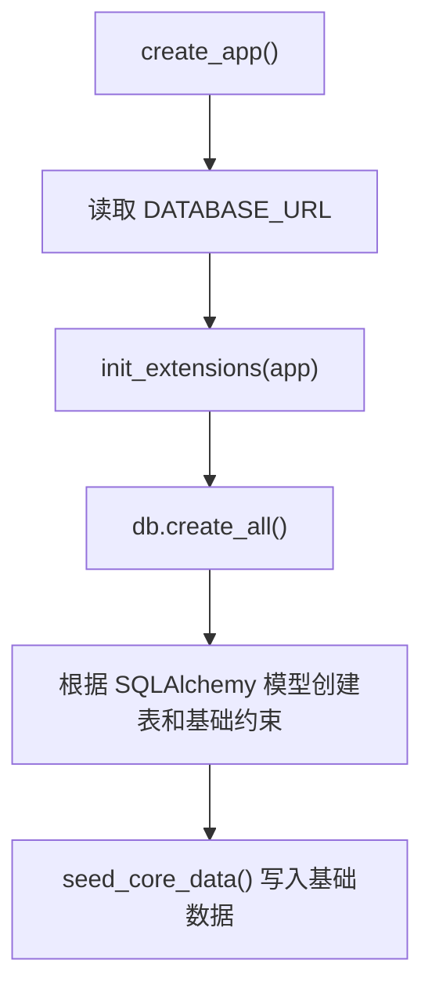
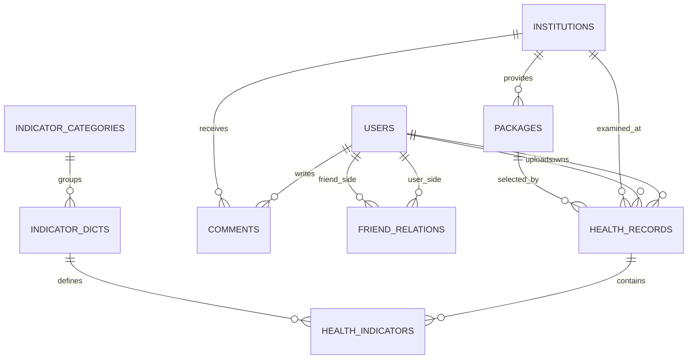
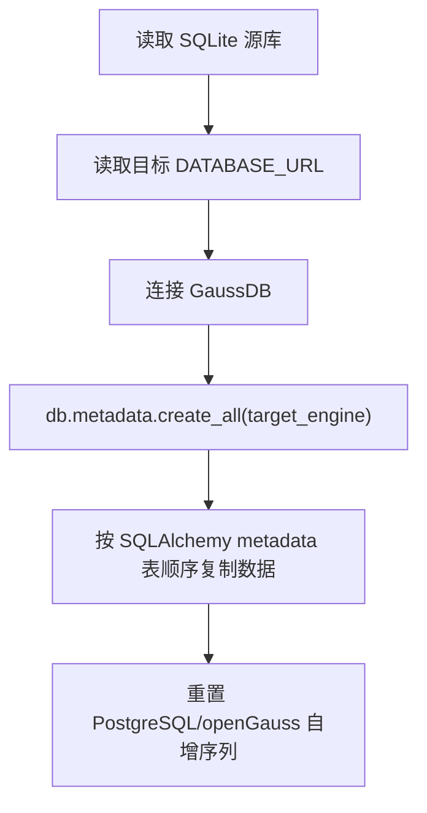

# 数据库设计说明

本文面向数据库设计整理本项目所有数据库相关内容，包括运行数据库、连接方式、数据表设计、完整性约束、触发器、CRUD 实现位置、DCL 权限边界、迁移脚本和测试验证。

## 1. 数据库运行方案

当前项目采用“本地前后端 + 华为云 GaussDB 数据库”的运行方式。


数据库相关结论：

| 项目 | 内容 |
|---|---|
| 当前运行库 | 华为云 GaussDB，openGauss 生态 |
| 数据库名 | `health_system` |
| 应用账号 | `health_app` |
| 连接方式 | 后端连接本机 `127.0.0.1:15432`，由 SSH 隧道转发到 GaussDB 内网地址 |
| 历史/测试库 | SQLite 仅作为历史迁移源和自动化测试库 |
| 数据库访问框架 | Flask-SQLAlchemy / SQLAlchemy |
| openGauss 方言 | `opengauss-sqlalchemy` |
| 连接驱动 | `psycopg2-binary` |
| MySQL 兼容驱动 | `PyMySQL` 已安装，仅作为 GaussDB(for MySQL) 或 MySQL 兼容库备用，不是当前运行库驱动 |

敏感信息说明：`backend/.env` 中保存真实 `DATABASE_URL` 和 `TARGET_DATABASE_URL`，包含数据库密码，不应提交、截图或写入文档。本文只记录连接串模板。

```env
DATABASE_URL=opengauss+psycopg2://health_app:<HEALTH_APP_PASSWORD>@127.0.0.1:15432/health_system?client_encoding=utf8
TARGET_DATABASE_URL=opengauss+psycopg2://health_app:<HEALTH_APP_PASSWORD>@127.0.0.1:15432/health_system?client_encoding=utf8
```

相关位置：

| 内容 | 文件 |
|---|---|
| 实际运行配置 | `backend/.env` |
| 配置模板 | `backend/.env.example` |
| Flask 读取数据库 URL | `backend/app/config.py` |
| SQLAlchemy 初始化 | `backend/app/extensions.py` |
| 后端启动建表入口 | `backend/app/__init__.py` |
| 开发启动入口 | `backend/run.py`，由 `scripts/start-backend-dev.ps1` 调用 |
| 生产启动入口 | `backend/wsgi.py`，由 Waitress 和 `scripts/start-backend-prod.ps1` 调用 |
| 数据库依赖包 | `backend/requirements.txt` |

连接池参数由 `backend/app/config.py` 从环境变量读取：

| 环境变量 | 默认值 | 说明 |
|---|---|---|
| `DB_POOL_SIZE` | `10` | SQLAlchemy 基础连接数 |
| `DB_MAX_OVERFLOW` | `20` | 超出连接池后的临时连接数 |
| `DB_POOL_TIMEOUT` | `30` | 获取连接等待秒数 |
| `DB_POOL_RECYCLE` | `1800` | 连接回收秒数 |

### 1.1 并发控制与锁设计

项目支持多用户并发访问。并发能力来自三层：

| 层次 | 实现 | 代码位置 |
|---|---|---|
| Web 服务线程 | 开发模式 Flask 使用 `threaded=True`，生产模式 Waitress 使用多线程 | `backend/run.py`、`scripts/start-backend-prod.ps1` |
| 数据库连接池 | SQLAlchemy 连接池控制并发连接数和等待时间 | `backend/app/config.py` |
| 数据库事务 | 每个请求通过 Flask-SQLAlchemy 的请求级 Session 执行查询、写入和 `commit()` | `backend/app/*/routes.py` |

当前代码没有显式使用应用层锁：

| 检查项 | 当前情况 |
|---|---|
| Python 线程锁 | 未使用 `threading.Lock` / `RLock` |
| 悲观锁查询 | 未使用 `with_for_update()` 或手写 `SELECT ... FOR UPDATE` |
| 手写锁表 | 未使用 `LOCK TABLE` |
| 乐观锁字段 | 未设计 `version` / `row_version` / `updated_at` 比较 |

因此，项目不是在应用代码里手动写 S 锁、X 锁。按数据库并发控制理论理解：

| 操作 | 并发控制方式 |
|---|---|
| 普通查询 | 由 GaussDB/openGauss 的 MVCC 提供一致性读，读操作通常不阻塞写操作 |
| `INSERT` / `UPDATE` / `DELETE` | 由数据库内部事务和锁管理器保护，写同一行时会获得排他性质的行级锁并串行化 |
| 唯一约束、外键、CHECK、触发器 | 由数据库在写入时统一校验，防止绕过后端接口写入非法数据 |

多个用户同时改写或删除数据时的行为：

| 场景 | 当前结果 |
|---|---|
| 多用户操作不同记录 | 正常并发执行，受连接池和数据库事务调度 |
| 多用户同时修改同一记录 | 数据库会串行化底层写入；由于没有乐观锁版本字段，业务层表现接近“最后提交者覆盖前一次修改” |
| 一个用户删除、另一个用户稍后修改同一记录 | 如果修改请求查询时记录已不存在，接口返回 `404` |
| 两个用户同时插入唯一键冲突数据 | 后端有预检查，数据库唯一约束继续兜底；极端竞态下数据库可能拒绝其中一个事务 |
| 触发器规则冲突 | 数据库触发器直接拒绝非法写入，例如套餐机构不匹配、评论前未上传该机构档案 |

可能的错误边界：

- 数据库一致性由事务、唯一约束、外键、CHECK 约束和触发器兜底，通常不会产生脏数据。
- 当前代码没有统一捕获所有数据库并发冲突异常；如果极端竞态导致数据库在 `commit()` 时抛出异常，可能走 Flask 500 错误处理。
- 当前没有解决“丢失更新”问题。如果课程答辩需要强调严格并发更新保护，可说明后续可增加乐观锁版本字段，或在关键读改写流程中使用 `SELECT ... FOR UPDATE` / SQLAlchemy `with_for_update()`。

并发相关定位：

| 内容 | 文件 |
|---|---|
| 开发模式多线程 | `backend/run.py` |
| 生产模式 Waitress 多线程 | `scripts/start-backend-prod.ps1` |
| SQLAlchemy 连接池 | `backend/app/config.py` |
| 请求级 Session 初始化 | `backend/app/extensions.py` |
| 主要更新/删除提交点 | `backend/app/users/routes.py`、`backend/app/records/routes.py`、`backend/app/comments/routes.py`、`backend/app/friends/routes.py` |
| 唯一约束和 CHECK 约束 | `backend/app/models/*.py` |
| 触发器兜底 | `backend/scripts/apply_gaussdb_rules.py` |

## 2. 数据库语言与代码组织

项目没有独立的 `.sql` 文件，也没有实际存在的 `migrations/` 或 `alembic` 迁移目录；当前工作区也没有本地 `.db`、`.sqlite`、`.sqlite3` 数据库文件。数据库语言和数据库相关代码分为三类：

| 类型 | 使用方式 | 写在哪里 |
|---|---|---|
| DDL 表结构 | 通过 SQLAlchemy 模型声明表、字段、主键、外键、唯一约束、CHECK 约束，再由 `db.create_all()` 生成 SQL | `backend/app/models/*.py`、`backend/app/__init__.py` |
| DDL 触发器和补充约束 | 直接写 openGauss/GaussDB SQL 与 PL/pgSQL 触发器函数 | `backend/scripts/apply_gaussdb_rules.py` |
| DML 增删改查 | 通过 ORM 写法表达，如 `Model.query`、`db.session.add()`、字段赋值、`db.session.delete()`、`db.session.commit()` | `backend/app/*/routes.py` |
| DCL 权限 | 项目代码没有 `GRANT` / `REVOKE` 脚本，权限在云数据库侧维护 | 文档中记录账号边界 |

启动时数据库初始化流程：



## 3. ER 关系设计



核心实体：

| 实体 | 表名 | 说明 |
|---|---|---|
| 用户 | `users` | 普通用户和管理员账号 |
| 亲友关系 | `friend_relations` | 用户之间的亲友关系与授权状态 |
| 体检机构 | `institutions` | 体检机构基础信息 |
| 体检套餐 | `packages` | 机构下属套餐 |
| 指标分类 | `indicator_categories` | 指标字典分类 |
| 指标字典 | `indicator_dicts` | 指标名称、别名、单位、参考范围 |
| 健康档案 | `health_records` | 用户上传或手动录入的体检档案 |
| 健康指标 | `health_indicators` | 某份档案中的具体指标值 |
| 评论 | `comments` | 用户对机构的评论和审核状态 |

## 4. 表结构设计

### 4.1 用户表 `users`

模型文件：`backend/app/models/user.py`

| 字段 | 类型 | 约束 | 说明 |
|---|---|---|---|
| `id` | Integer | PK | 用户 ID |
| `username` | String(80) | UNIQUE, NOT NULL | 用户名 |
| `password_hash` | String(255) | NOT NULL | bcrypt 密码哈希 |
| `email` | String(120) | UNIQUE, NULL | 邮箱 |
| `phone` | String(30) | NULL | 手机号 |
| `role` | String(20) | NOT NULL, default `user` | 角色，普通用户或管理员 |
| `created_at` | DateTime(timezone=True) | NOT NULL | 创建时间 |

表级约束：

| 约束名 | 规则 |
|---|---|
| `ck_users_role` | `role in ('user', 'admin')` |
| `ck_users_username_not_blank` | `length(trim(username)) > 0` |

候选键：

| 候选键 | 说明 |
|---|---|
| `username` | 登录唯一标识 |
| `email` | 邮箱唯一，允许为空 |

### 4.2 亲友关系表 `friend_relations`

模型文件：`backend/app/models/friend.py`

| 字段 | 类型 | 约束 | 说明 |
|---|---|---|---|
| `id` | Integer | PK | 关系 ID |
| `user_id` | Integer | FK `users.id`, NOT NULL, index | 添加亲友的一方 |
| `friend_user_id` | Integer | FK `users.id`, NOT NULL, index | 被添加的一方 |
| `relation_name` | String(80) | NOT NULL, default `亲友` | 关系名称 |
| `auth_status` | Boolean | NOT NULL, default false | 是否授权对方管理档案 |
| `created_at` | DateTime(timezone=True) | NOT NULL | 创建时间 |

表级约束：

| 约束名 | 规则 |
|---|---|
| `uq_friend_pair` | `(user_id, friend_user_id)` 唯一 |
| `ck_friend_not_self` | `user_id <> friend_user_id` |
| `ck_friend_relation_name_not_blank` | `length(trim(relation_name)) > 0` |

### 4.3 体检机构表 `institutions`

模型文件：`backend/app/models/institution.py`

| 字段 | 类型 | 约束 | 说明 |
|---|---|---|---|
| `id` | Integer | PK | 机构 ID |
| `name` | String(120) | NOT NULL | 机构名称 |
| `branch_name` | String(120) | NOT NULL | 分院名称 |
| `address` | String(255) | NOT NULL | 地址 |
| `district` | String(80) | NOT NULL | 区域 |
| `metro_info` | String(255) | NULL | 地铁信息 |
| `consult_phone` | String(30) | NULL | 咨询电话 |
| `ext` | String(20) | NULL | 分机号 |
| `closed_day` | String(20) | NULL | 闭馆日 |
| `description` | Text | NULL | 描述 |
| `logo_url` | String(255) | NULL | Logo 地址 |

表级约束：

| 约束名 | 规则 |
|---|---|
| `uq_institution_branch` | `(name, branch_name)` 唯一 |
| `ck_institutions_name_not_blank` | `length(trim(name)) > 0` |
| `ck_institutions_branch_not_blank` | `length(trim(branch_name)) > 0` |
| `ck_institutions_address_not_blank` | `length(trim(address)) > 0` |
| `ck_institutions_district_not_blank` | `length(trim(district)) > 0` |

### 4.4 体检套餐表 `packages`

模型文件：`backend/app/models/institution.py`

| 字段 | 类型 | 约束 | 说明 |
|---|---|---|---|
| `id` | Integer | PK | 套餐 ID |
| `institution_id` | Integer | FK `institutions.id`, NOT NULL, index | 所属机构 |
| `name` | String(120) | NOT NULL | 套餐名称 |
| `focus_area` | String(120) | NOT NULL | 重点方向 |
| `gender_scope` | String(40) | NOT NULL, default `all` | 适用性别 |
| `price` | Numeric(10, 2) | NOT NULL, default `0.00` | 价格 |
| `description` | Text | NULL | 套餐描述 |

表级约束：

| 约束名 | 规则 |
|---|---|
| `uq_package_institution_name` | `(institution_id, name)` 唯一 |
| `ck_packages_name_not_blank` | `length(trim(name)) > 0` |
| `ck_packages_focus_area_not_blank` | `length(trim(focus_area)) > 0` |
| `ck_packages_gender_scope` | `gender_scope in ('all', 'male', 'female', 'female_all')` |
| `ck_packages_price_non_negative` | `price >= 0` |

### 4.5 指标分类表 `indicator_categories`

模型文件：`backend/app/models/indicator.py`

| 字段 | 类型 | 约束 | 说明 |
|---|---|---|---|
| `id` | Integer | PK | 分类 ID |
| `name` | String(80) | UNIQUE, NOT NULL | 分类名称 |
| `sort_order` | Integer | NOT NULL, default 0 | 排序值 |

表级约束：

| 约束名 | 规则 |
|---|---|
| `ck_indicator_categories_name_not_blank` | `length(trim(name)) > 0` |

### 4.6 指标字典表 `indicator_dicts`

模型文件：`backend/app/models/indicator.py`

| 字段 | 类型 | 约束 | 说明 |
|---|---|---|---|
| `id` | Integer | PK | 指标 ID |
| `category_id` | Integer | FK `indicator_categories.id`, NOT NULL, index | 所属分类 |
| `code` | String(40) | UNIQUE, NOT NULL, index | 指标编码 |
| `name` | String(120) | NOT NULL | 指标名称 |
| `aliases` | JSON | NOT NULL, default list | OCR 匹配别名 |
| `unit` | String(40) | NULL | 单位 |
| `reference_low` | Numeric(10, 2) | NULL | 参考下限 |
| `reference_high` | Numeric(10, 2) | NULL | 参考上限 |
| `clinical_significance` | Text | NULL | 临床意义 |
| `value_type` | String(20) | NOT NULL, default `numeric` | 数值型或文本型 |

表级约束：

| 约束名 | 规则 |
|---|---|
| `uq_indicator_category_name` | `(category_id, name)` 唯一 |
| `ck_indicator_dicts_code_not_blank` | `length(trim(code)) > 0` |
| `ck_indicator_dicts_name_not_blank` | `length(trim(name)) > 0` |
| `ck_indicator_dicts_value_type` | `value_type in ('numeric', 'text')` |
| `ck_indicator_dicts_reference_range` | `reference_low is null or reference_high is null or reference_low <= reference_high` |

候选键：

| 候选键 | 说明 |
|---|---|
| `code` | 全局唯一指标编码 |
| `(category_id, name)` | 同一分类下指标名称唯一 |

### 4.7 健康档案表 `health_records`

模型文件：`backend/app/models/record.py`

| 字段 | 类型 | 约束 | 说明 |
|---|---|---|---|
| `id` | Integer | PK | 档案 ID |
| `owner_id` | Integer | FK `users.id`, NOT NULL, index | 档案归属人 |
| `uploader_id` | Integer | FK `users.id`, NOT NULL | 上传人或录入人 |
| `institution_id` | Integer | FK `institutions.id`, NULL, index | 体检机构 |
| `package_id` | Integer | FK `packages.id`, NULL | 体检套餐 |
| `exam_date` | Date | NOT NULL, index | 体检日期 |
| `report_file_url` | String(255) | NULL | 报告文件地址 |
| `ocr_raw_text` | Text | NULL | OCR 原始文本 |
| `status` | String(20) | NOT NULL, default `confirmed` | 档案状态 |
| `created_at` | DateTime(timezone=True) | NOT NULL | 创建时间 |

表级约束：

| 约束名 | 规则 |
|---|---|
| `ck_health_records_status` | `status in ('draft', 'parsed', 'confirmed')` |

设计说明：

- `owner_id` 和 `uploader_id` 分开保存，用于支持本人录入和亲友代传。
- `institution_id` 和 `package_id` 允许为空，适配手动录入和 OCR 初始解析未完全映射的情况。
- `package_id` 与 `institution_id` 的跨表一致性由数据库触发器兜底。

### 4.8 健康指标记录表 `health_indicators`

模型文件：`backend/app/models/record.py`

| 字段 | 类型 | 约束 | 说明 |
|---|---|---|---|
| `id` | Integer | PK | 指标记录 ID |
| `record_id` | Integer | FK `health_records.id`, NOT NULL, index | 所属档案 |
| `indicator_dict_id` | Integer | FK `indicator_dicts.id`, NOT NULL, index | 指标字典项 |
| `value` | String(120) | NOT NULL | 指标值 |
| `is_abnormal` | Boolean | NOT NULL, default false | 是否异常 |
| `source` | String(20) | NOT NULL, default `manual` | 来源，手动或 OCR |

表级约束：

| 约束名 | 规则 |
|---|---|
| `uq_record_indicator` | `(record_id, indicator_dict_id)` 唯一 |
| `ck_health_indicators_value_not_blank` | `length(trim(value)) > 0` |
| `ck_health_indicators_source` | `source in ('manual', 'ocr')` |

设计说明：

- 同一份体检档案中，同一个指标字典项只能出现一次。
- `is_abnormal` 由触发器根据指标字典参考范围自动维护，后端也可计算但数据库层负责最终兜底。

### 4.9 评论表 `comments`

模型文件：`backend/app/models/comment.py`

| 字段 | 类型 | 约束 | 说明 |
|---|---|---|---|
| `id` | Integer | PK | 评论 ID |
| `user_id` | Integer | FK `users.id`, NOT NULL, index | 评论用户 |
| `institution_id` | Integer | FK `institutions.id`, NOT NULL, index | 被评论机构 |
| `content` | Text | NOT NULL | 评论内容 |
| `rating` | Integer | NOT NULL | 评分 |
| `is_visible` | Boolean | NOT NULL, default false | 是否审核可见 |
| `created_at` | DateTime(timezone=True) | NOT NULL | 创建时间 |

表级约束：

| 约束名 | 规则 |
|---|---|
| `ck_comments_rating_range` | `rating between 1 and 5` |
| `ck_comments_content_not_blank` | `length(trim(content)) > 0` |

设计说明：

- 评论默认不可见，需要管理员审核。
- “用户必须先上传该机构档案才能评论”由触发器兜底。

## 5. 完整性约束设计

完整性约束分为模型层约束和云数据库补充规则。

### 5.1 模型层约束

模型层写在 `backend/app/models/*.py`，通过 SQLAlchemy 生成 DDL。

| 约束类型 | 示例 |
|---|---|
| 主键 | 所有业务表均使用 `id` 作为主键 |
| 外键 | `health_records.owner_id -> users.id`、`health_indicators.record_id -> health_records.id` |
| 唯一约束 | `users.username`、`indicator_dicts.code`、`uq_record_indicator` |
| CHECK 约束 | 角色、状态、评分、价格、非空文本、参考范围等 |
| NOT NULL | 关键业务字段不可为空 |
| 索引 | 常用查询字段如 `owner_id`、`exam_date`、`institution_id` 设置 index |

级联删除边界：

| 位置 | 说明 |
|---|---|
| SQLAlchemy 关系 | `Institution.packages`、`HealthRecord.indicators` 配置了 ORM 层 `cascade="all, delete-orphan"` |
| 数据库外键 | 模型中没有显式配置 `ON DELETE CASCADE`，因此数据库级删除级联不是当前设计重点 |
| 路由层删除 | 删除用户等复杂场景由后端路由先删除关联关系、评论和档案，再删除主对象 |

### 5.2 CHECK 约束清单

当前云端 GaussDB 已落库 `22` 个 CHECK 约束：

| 表 | 约束 |
|---|---|
| `users` | `ck_users_role`、`ck_users_username_not_blank` |
| `friend_relations` | `ck_friend_not_self`、`ck_friend_relation_name_not_blank` |
| `comments` | `ck_comments_rating_range`、`ck_comments_content_not_blank` |
| `indicator_categories` | `ck_indicator_categories_name_not_blank` |
| `indicator_dicts` | `ck_indicator_dicts_code_not_blank`、`ck_indicator_dicts_name_not_blank`、`ck_indicator_dicts_value_type`、`ck_indicator_dicts_reference_range` |
| `institutions` | `ck_institutions_name_not_blank`、`ck_institutions_branch_not_blank`、`ck_institutions_address_not_blank`、`ck_institutions_district_not_blank` |
| `packages` | `ck_packages_name_not_blank`、`ck_packages_focus_area_not_blank`、`ck_packages_gender_scope`、`ck_packages_price_non_negative` |
| `health_records` | `ck_health_records_status` |
| `health_indicators` | `ck_health_indicators_value_not_blank`、`ck_health_indicators_source` |

### 5.3 触发器设计

触发器和触发器函数写在 `backend/scripts/apply_gaussdb_rules.py`。这些规则属于数据库级 DDL，主要用于防止绕过后端接口时写入非法数据。

| 触发器 | 表 | 时机 | 作用 |
|---|---|---|---|
| `trg_health_records_package_match` | `health_records` | BEFORE INSERT OR UPDATE OF `institution_id`, `package_id` | 保证档案中的套餐属于对应机构；如果只传套餐，则自动补齐机构 |
| `trg_comments_require_uploaded_record` | `comments` | BEFORE INSERT OR UPDATE OF `user_id`, `institution_id` | 保证用户评论机构前已经上传过该机构档案 |
| `trg_health_indicators_set_abnormal` | `health_indicators` | BEFORE INSERT OR UPDATE OF `value`, `indicator_dict_id` | 根据指标字典参考范围自动维护 `is_abnormal` |

触发器函数语言：

| 内容 | 语言 |
|---|---|
| 触发器函数 | PL/pgSQL |
| 查询与约束语句 | SQL |
| 执行脚本 | Python + SQLAlchemy `text()` |

执行方式：

```powershell
Set-Location "H:\CODE\DA Project\health system\backend"
.\.venv\Scripts\python.exe .\scripts\apply_gaussdb_rules.py
```

注意：给现有云库添加触发器和约束属于 DDL 维护，通常需要管理员账号。日常后端运行账号仍应使用 `health_app`。

## 6. 规范化设计

本项目按实体表、字典表、关系表拆分，目标范式为 3NF，并通过候选键约束强化关键业务表。

| 设计点 | 说明 |
|---|---|
| 用户信息独立 | 用户账号信息只存储在 `users`，其他表通过用户 ID 引用 |
| 机构与套餐分离 | `institutions` 保存机构，`packages` 保存机构下套餐，避免重复存储机构详情 |
| 指标字典与指标值分离 | `indicator_dicts` 保存指标定义，`health_indicators` 只保存某次体检的结果值 |
| 档案与指标一对多 | `health_records` 表示一次体检，`health_indicators` 表示该次体检的多项指标 |
| 亲友关系单独建表 | `friend_relations` 保存用户间授权关系，不污染用户主表 |
| 评论单独建表 | `comments` 独立保存评论内容、评分和审核状态 |

关键候选键：

| 表 | 候选键 |
|---|---|
| `users` | `username`、`email` |
| `institutions` | `(name, branch_name)` |
| `packages` | `(institution_id, name)` |
| `indicator_categories` | `name` |
| `indicator_dicts` | `code`、`(category_id, name)` |
| `health_indicators` | `(record_id, indicator_dict_id)` |
| `friend_relations` | `(user_id, friend_user_id)` |

## 7. CRUD 与 DML 实现位置

后端没有以字符串形式集中书写 `SELECT`、`INSERT`、`UPDATE`、`DELETE`，而是通过 SQLAlchemy ORM 表达 DML。

| 模块 | 文件 | 数据库操作 |
|---|---|---|
| 认证 | `backend/app/auth/routes.py` | 注册插入用户、登录查询用户、刷新 token 查询用户 |
| 用户管理 | `backend/app/users/routes.py` | 查询用户、修改用户、删除用户及关联数据 |
| 亲友关系 | `backend/app/friends/routes.py` | 添加亲友、查询双向关系列表、改名、授权开关、删除关系 |
| 机构 | `backend/app/institutions/routes.py` | 查询机构、机构详情、机构套餐 |
| 指标字典 | `backend/app/indicators/routes.py` | 查询指标字典和分类 |
| 健康档案 | `backend/app/records/routes.py` | 查询档案、新增档案、OCR 上传入档、确认档案、修改档案、删除档案 |
| 健康指标 | `backend/app/records/routes.py` | 新增指标、修改指标、删除指标 |
| 评论 | `backend/app/comments/routes.py` | 查询评论、我的评论、提交评论、审核可见性、修改评论、删除评论 |
| 趋势 | `backend/app/trends/routes.py` | 按指标查询趋势，包含 `health_indicators` 和 `health_records` join |

常见 ORM 到 SQL 的对应关系：

| ORM 写法 | 对应 DML |
|---|---|
| `Model.query.filter_by(...).first()` | `SELECT ... WHERE ... LIMIT 1` |
| `Model.query.order_by(...).all()` | `SELECT ... ORDER BY ...` |
| `db.session.get(Model, id)` | 按主键查询 |
| `db.session.add(obj)` + `commit()` | `INSERT` |
| 字段赋值 + `commit()` | `UPDATE` |
| `db.session.delete(obj)` + `commit()` | `DELETE` |
| `db.session.query(A, B).join(...)` | `SELECT ... JOIN ...` |

## 8. DCL 权限设计

项目代码中没有保存 `GRANT`、`REVOKE`、`CREATE USER` 等 DCL 脚本。权限在华为云 GaussDB 管理侧完成，项目文档记录账号边界：

| 账号 | 设计用途 |
|---|---|
| `root` | GaussDB 管理员账号，仅用于建库、建用户、授权、DDL 维护 |
| `health_app` | 后端应用账号，用于日常业务读写 |

设计原则：

- 后端运行必须使用 `health_app`，不要使用 `root`。
- `health_app` 保留业务读写权限，不授予日常表结构变更权限。
- CHECK 约束和触发器维护需要管理员连接串时，应临时使用管理员账号执行，执行后不写入 `.env`。
- 数据库密码不写入 README、项目文档和代码提交。

## 9. 数据迁移设计

迁移脚本：`backend/scripts/migrate_sqlite_to_cloud.py`

用途：

- 将历史 SQLite 数据复制到云端 GaussDB。
- 可通过 `TARGET_DATABASE_URL` 或 `DATABASE_URL` 指定目标库。
- 可选 `--replace` 清空目标表后重新导入。
- 支持 openGauss/PostgreSQL 序列重置。
- 支持通过 SSH 隧道连接云端内网数据库。

关键流程：



相关文件：

| 内容 | 文件 |
|---|---|
| 数据迁移脚本 | `backend/scripts/migrate_sqlite_to_cloud.py` |
| SSH 隧道脚本 | `backend/scripts/open_ssh_tunnel.py` |
| 后端启动脚本 | `scripts/start-backend-dev.ps1`、`scripts/start-backend-prod.ps1` |
| 全量启动脚本 | `scripts/start-full-dev.ps1`、`scripts/start-full-prod.ps1` |

当前文档记录的云端迁移校验数据量：

| 表 | 行数 |
|---|---:|
| `users` | 2 |
| `health_records` | 12 |
| `health_indicators` | 2 |
| `comments` | 1 |
| `institutions` | 3 |
| `packages` | 15 |
| `indicator_categories` | 5 |
| `indicator_dicts` | 10 |
| `friend_relations` | 0 |

## 10. 初始数据设计

初始数据写在 `backend/app/seed.py`，由 `seed_core_data()` 在后端启动时调用。

种子数据包括：

| 类型 | 表 |
|---|---|
| 体检机构 | `institutions` |
| 体检套餐 | `packages` |
| 指标分类 | `indicator_categories` |
| 指标字典 | `indicator_dicts` |
| 默认管理员 | `users` |

设计说明：

- 如果机构或指标字典已有数据，种子逻辑会避免重复插入。
- 默认管理员账号可通过环境变量覆盖。
- 种子数据用于演示和基础业务运行，不替代业务数据。

## 11. 测试与验证

测试数据库：

| 环境 | 数据库 |
|---|---|
| 自动化测试 | `sqlite:///:memory:` |
| 演示/运行 | 华为云 GaussDB |

测试入口：

| 内容 | 文件 |
|---|---|
| 测试建库/清库 | `backend/tests/conftest.py` |
| CHECK 约束注册测试 | `backend/tests/test_database_rules.py` |
| 认证与用户 CRUD 测试 | `backend/tests/test_auth.py`、`backend/tests/test_users_admin.py` |
| 亲友关系测试 | `backend/tests/test_friends.py` |
| 档案与指标测试 | `backend/tests/test_records.py` |
| OCR 入档测试 | `backend/tests/test_ocr.py` |
| 机构查询测试 | `backend/tests/test_institutions.py` |
| 评论测试 | `backend/tests/test_comments.py` |
| 趋势查询测试 | `backend/tests/test_trends.py` |

云端规则验证结果：

| 项目 | 结果 |
|---|---|
| CHECK 约束 | 22 个 |
| 触发器 | 3 个 |
| 触发器清单 | `trg_health_records_package_match`、`trg_comments_require_uploaded_record`、`trg_health_indicators_set_abnormal` |

已验证规则：

- 评论评分越界会被 CHECK 约束拦截。
- 档案套餐机构不匹配会被触发器拦截。
- 指标异常标记由触发器自动维护。

## 12. 数据库相关文件索引

| 分类 | 文件 |
|---|---|
| 运行配置 | `backend/.env`、`backend/.env.example`、`backend/app/config.py` |
| 扩展初始化 | `backend/app/extensions.py` |
| App 初始化与建表 | `backend/app/__init__.py` |
| 后端启动入口 | `backend/run.py`、`backend/wsgi.py`、`scripts/start-backend-dev.ps1`、`scripts/start-backend-prod.ps1` |
| 数据模型 | `backend/app/models/user.py`、`backend/app/models/friend.py`、`backend/app/models/institution.py`、`backend/app/models/indicator.py`、`backend/app/models/record.py`、`backend/app/models/comment.py` |
| 种子数据 | `backend/app/seed.py` |
| CRUD 路由 | `backend/app/auth/routes.py`、`backend/app/users/routes.py`、`backend/app/friends/routes.py`、`backend/app/institutions/routes.py`、`backend/app/indicators/routes.py`、`backend/app/records/routes.py`、`backend/app/comments/routes.py`、`backend/app/trends/routes.py` |
| 规则脚本 | `backend/scripts/apply_gaussdb_rules.py` |
| 迁移脚本 | `backend/scripts/migrate_sqlite_to_cloud.py` |
| SSH 隧道 | `backend/scripts/open_ssh_tunnel.py` |
| 测试 | `backend/tests/*.py` |
| 前端 API 调用 | `frontend/src/api/*.js` |
| 项目总说明 | `README.md`、`backend/README.md` |
| 部署文档 | `项目文档/部署演示与云数据库指南.md` |
| 规范化说明 | `项目文档/数据库规范化说明.md` |
| 测试报告 | `项目文档/测试报告.md` |

## 13. 设计注意事项

1. 新建表、字段、外键、唯一约束、CHECK 约束时，优先修改 `backend/app/models/*.py`。
2. 涉及跨表业务规则、自动维护字段、绕过后端也必须兜底的规则，应考虑补充 GaussDB 触发器，并写入 `backend/scripts/apply_gaussdb_rules.py`。
3. 现有云库已有数据时，不应随意删表重建，应通过可重复执行的 DDL 脚本补齐规则。
4. 日常后端运行使用 `health_app`，DDL 维护才临时使用管理员账号。
5. 前端不直接连接数据库，只通过后端 REST API 访问数据。
6. 自动化测试使用内存 SQLite，不依赖云数据库；云端触发器需要在 GaussDB 环境单独验证。
7. `backend/.env` 包含真实数据库连接密码，属于敏感文件。
8. 当前并发控制依赖 GaussDB/openGauss 事务、MVCC 和数据库内部行锁；代码没有显式 S/X 锁、`FOR UPDATE` 或乐观锁版本字段。
